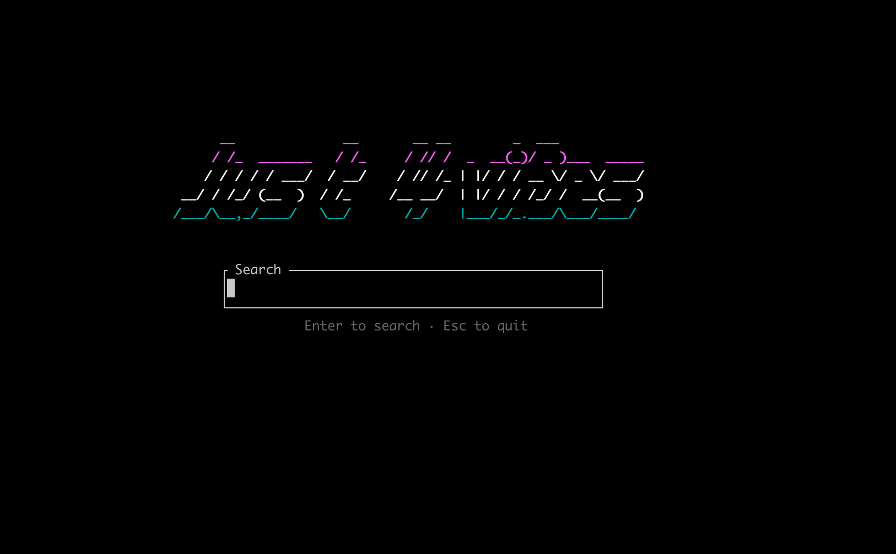

# just-for-vibes (j4v)

A TUI web browser. Any website, rendered as a pure terminal interface.



## Concept

- Homepage: Google-style search page (input + Search + I'm Feeling Lucky)
- Search results: real websites, clickable
- Clicking a result: proxied through a Cloudflare Worker that converts HTML → TUI-renderable format
- Usable by humans AND AI agents (it's already text)

## Architecture

```
j4v (single Rust binary, 3.7MB)
├── TUI mode (default): interactive terminal browser
├── Agent mode (--json): structured output for AI agents
└── Direct mode (--url): fetch + render a specific page
```

No server, no proxy, no deployment. Just a fast local binary.

## Stack

- **Language**: Rust + ratatui (instant startup, zero GC, single binary)
- **Search**: DuckDuckGo HTML lite (free, no API key)
- **Rendering**: HTML → strip noise → structured text (headings, paragraphs, links)

## Usage

```bash
# Interactive TUI browser
j4v

# Fetch a page directly
j4v --url https://example.com

# Agent mode: JSON output for AI consumption
j4v --url https://example.com --json
```

## Wire Format (draft)

```json
{
  "title": "Page Title",
  "url": "https://example.com",
  "elements": [
    {"type": "heading", "level": 1, "text": "Welcome"},
    {"type": "text", "content": "Some paragraph text..."},
    {"type": "link", "text": "Click here", "href": "/page2"},
    {"type": "input", "name": "q", "placeholder": "Search..."},
    {"type": "button", "text": "Submit", "action": "/search"},
    {"type": "list", "items": ["Item 1", "Item 2"]},
    {"type": "image", "alt": "Photo description", "src": "..."}
  ]
}
```

## Milestones

1. ~~**Search**: DDG search from homepage~~ ✅
2. ~~**Browse**: Fetch + render page content~~ ✅
3. **Agent mode**: `--url` and `--json` flags for non-interactive use
4. **Better parsing**: Handle more HTML elements, word wrapping
5. **Navigation**: Click links within pages, back/forward stack
6. **Forms**: Submit search forms, login forms
7. **Polish**: Loading states, error handling, bookmarks, history
